# 1、创建仓库

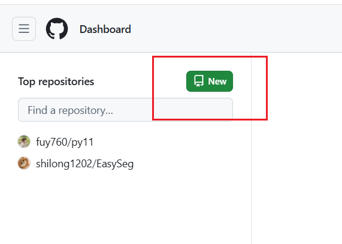


==获得仓库地址==


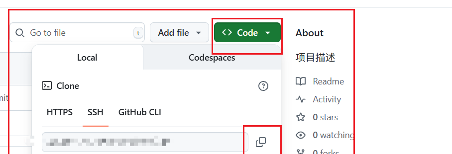


# 2、生成密钥

## 🧠 先讲一下概念（理解之后你会更容易操作）

### 一、什么是 SSH？

SSH 全称是 **Secure Shell**，意思是“安全外壳协议”。它是：

- 一种 **加密的远程登录协议**。
- 让你可以安全地连接到服务器或 GitHub 等服务，不怕中途被窃听。


### 二、什么是 SSH 密钥？

SSH 密钥是一对密钥：**私钥（private key）+ 公钥（public key）**。

| 名称 | 存在哪里       | 用途           | 是否公开       |
| ---- | -------------- | -------------- | -------------- |
| 私钥 | 你电脑里       | 类似你的“钥匙” | **不能外泄！** |
| 公钥 | 存在 GitHub 上 | 类似“锁孔”     | 可以公开       |

连接过程大概是这样：

1. GitHub 收到你电脑发来的“请求登录”。
2. GitHub 拿出它保存的“公钥”，看你给的“私钥”能不能配得上它。
3. 能配上，就让你通过，不用输入密码。


### 第一步：检查你是否已经有 SSH 密钥

打开终端（Windows 可以用 Git Bash 或 PowerShell）：

```
bash
复制编辑
ls ~/.ssh
```

如果你看到有像 `id_rsa` 和 `id_rsa.pub` 这样的文件，说明你之前生成过密钥，可以跳过生成直接用。


### 第二步：生成新的 SSH 密钥对

```
bash

复制编辑
ssh-keygen -t ed25519 -C "your_email@example.com"
```

解释一下：

- `-t ed25519` 表示生成 ed25519 算法的密钥（推荐，比 RSA 更快更安全）
- `-C "your_email"` 是给这个密钥加个备注，通常用 GitHub 的邮箱

它会问你：

```
text

复制编辑
Enter file in which to save the key (/home/yourname/.ssh/id_ed25519):
```

👉 直接按回车（默认位置就好）

```
text

复制编辑
Enter passphrase (empty for no passphrase):
```

👉 可以输入一个密码保护私钥（也可以直接回车跳过）


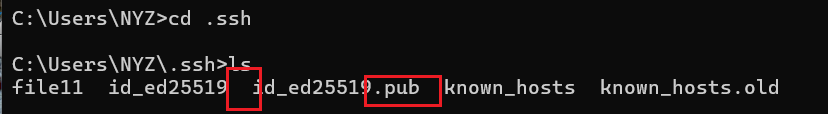


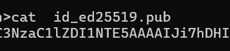


# 3、密钥放到github


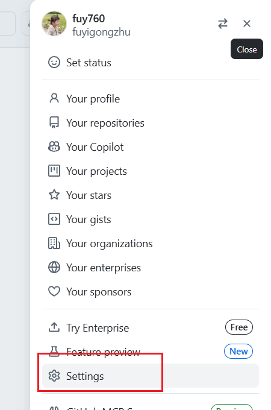


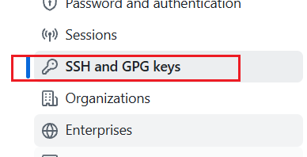


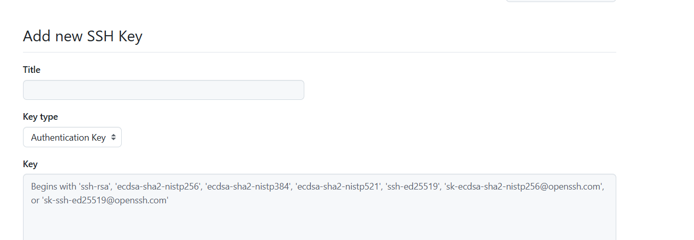


# 4、git clone仓库地址


新建文件


在文件夹里面，右键


若要克隆存储库，可以运行以下命令：

git clone ssh://[git@ssh.github.com:443/YOUR-USERNAME/YOUR-REPOSITORY.git](git@ssh.github.com:443/YOUR-USERNAME/YOUR-REPOSITORY.git)

把原有仓库的冒号后面的部分，放到443/后面

 

例如：git clone [git@github.com:cskaoyan/python25.git](git@github.com:cskaoyan/python25.git)

​          替换后的

git clone ssh://[git@ssh.github.com:443/](git@ssh.github.com:443/YOUR-USERNAME/YOUR-REPOSITORY.git)cskaoyan/python25.git


这就是配置文件


# 5、如何添加文件


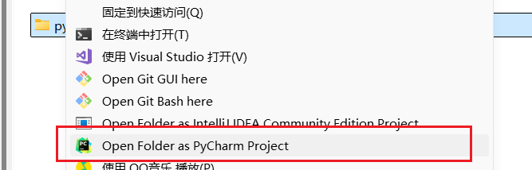


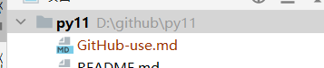


==红色就是没有添加==


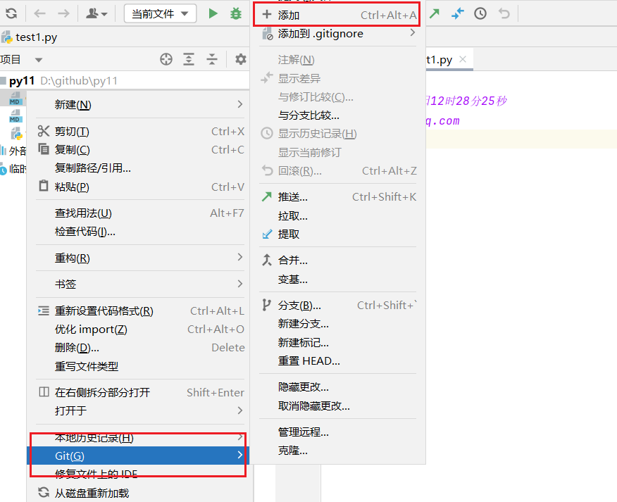


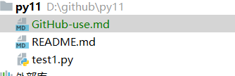


==绿色就是添加==


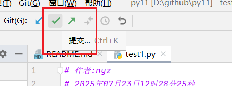


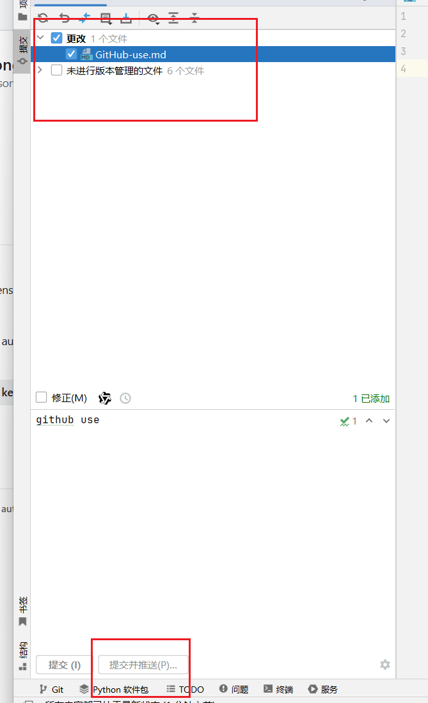


# 6、如何删除github仓库文件，但是保存本地文件


git rm --cached 文件名
git commit -m "从仓库中移除 GitHub-use.md，但保留本地文件"
git push


# 7、http

克隆使用http地址即可
