# 一、Latex

## 1、网站

在线LaTeX编辑器：https://www.overleaf.com 

TeX Live下载：https://www.tug.org/texlive/acquire-iso.html 

MikTeX下载：https://miktex.org/download 

LaTeX 公式编辑器：https://latex.codecogs.com/eqneditor/editor.php 

一份不太简短的LaTeX介绍：https://github.com/CTeX-org/lshort-zh-cn

## 2、常用命令

### 1、基本介绍

Latex中所有的命令都以 \ 开头

\命令名{}

后面可以跟一个花括号，代表这个命令的参数

位于\begin{}和\end{}之间的属于同一个环境

\documentclass{article}

article代表普通的文章

其它还有book、report等等

幻灯片使用beamer

如果要中英文结合需要

~~~
\documentclass[UTF8]{ctexart}
 
% 中文文章类，自动支持中文
\begin{document}
你好，世界
\end{document}

~~~

此时，编译器需要选择XeLaTex，天生支持Unicode(UTF-8)

所有在begin{document}前面的都被称为前言

所有在begin和end中间的是正文

\title{文章的标题}

\author{作者}

\data{\today}命令，自动生成当天日期

要显示这些信息，需要在文档中添加一个\maketitle命令

\textbf{Latex}，加粗文字，写到括号里

\textit{}，斜体

\underline{},下划线

添加新的段落的话两个enter，一个enter是空格

### 2、section命令

要开启新章节的话使用section命令

~~~
\documentclass[UTF8]{ctexart}
\author{牛源哲}
\title{嗯嗯嗯}
\date{\today}
% 中文文章类，自动支持中文
\begin{document}
\maketitle
你好，世界

enen
enen
\section{第一章节}
哈哈哈哈
\subsection{第二章节}
嗯嗯嗯
\subsubsection{三}
你好

\end{document}
~~~

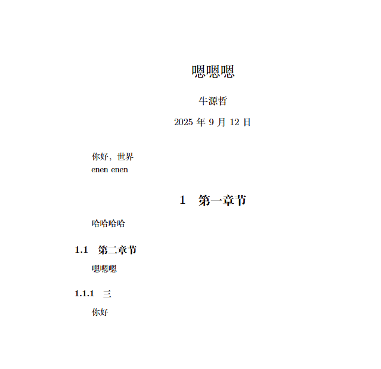

### 3、使用图片

~~~
\documentclass[UTF8]{ctexart}

\usepackage{graphicx}

% 中文文章类，自动支持中文
\begin{document}

\includegraphics[width=0.5\textwidth]{picture/text.jpg}

\end{document}
~~~

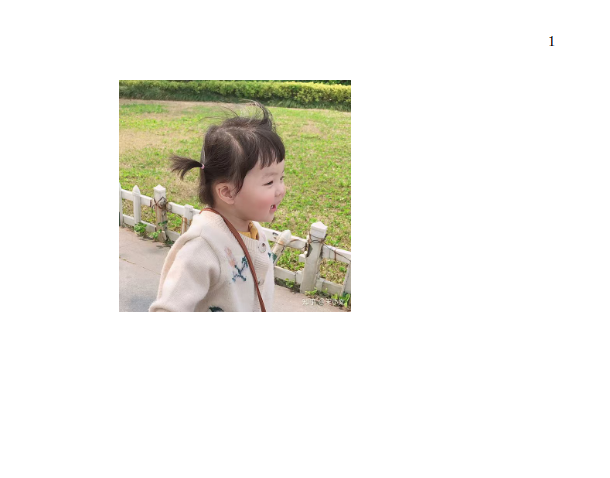

### 4、给图片添加标题

==先将放入figure环境==

~~~
\documentclass[UTF8]{ctexart}

\usepackage{graphicx}

% 中文文章类，自动支持中文
\begin{document}

\begin{figure}
\centering
\includegraphics[width=0.5\textwidth]{picture/text.jpg}
\caption{这是一个绿色的图片}

\end{figure}
\end{document}

~~~

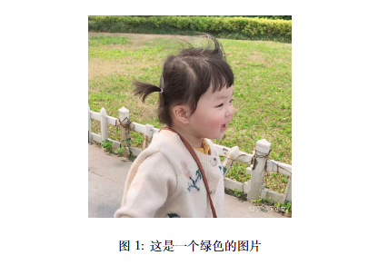

## 3、列表

### 1、无序列表

==itemize环境中==

~~~
\documentclass[UTF8]{ctexart}

\usepackage{graphicx}

% 中文文章类，自动支持中文
\begin{document}

\begin{itemize}
    \item 列表项1
    \item 列表项2
    \item 列表项3
\end{itemize}

\end{document}

~~~

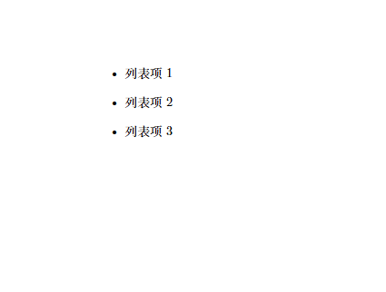

### 2、有序列表

==enumerate环境==

~~~
\documentclass[UTF8]{ctexart}

\usepackage{graphicx}

% 中文文章类，自动支持中文
\begin{document}

\begin{enumerate}
    \item 列表项1
    \item 列表项2
    \item 列表项3
\end{enumerate}

\end{document}

~~~

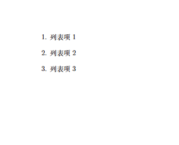

## 4、公式

### 1、行内公式

==使用$ $==

~~~
\documentclass[UTF8]{ctexart}

\usepackage{graphicx}

% 中文文章类，自动支持中文
\begin{document}

爱因斯坦发明的智能守衡方程为：$E=mc^2$

\end{document}

~~~

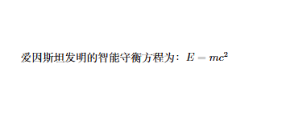

### 2、单独一行

==将公式写在equation环境==

~~~
\documentclass[UTF8]{ctexart}

\usepackage{graphicx}

% 中文文章类，自动支持中文
\begin{document}

爱因斯坦发明的智能守衡方程为：

\begin{equation}
E=mc^2
\end{equation}

\end{document}
~~~

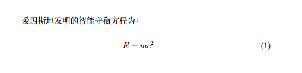

~~~
\documentclass[UTF8]{ctexart}

\usepackage{graphicx}

% 中文文章类，自动支持中文
\begin{document}

爱因斯坦发明的智能守衡方程为：

\[
E=mc^2
\]

\end{document}
~~~

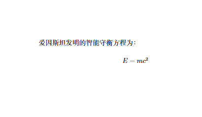

### 3、特殊语法

==\over 前面分子，后面分母，\varphi，小写的φ，\phi大写的φ==

~~~
\documentclass[UTF8]{ctexart}

\usepackage{graphicx}

% 中文文章类，自动支持中文
\begin{document}

\begin{equation}
d={{k \varphi(n)+1} \over e}
\end{equation}

\end{document}

~~~

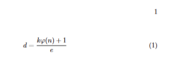

## 5、表格

### 1、表格

==写入tabular环境==

==参数c代表几列，三个c就是三列，每一行表格写完需要&，换表格，每一行写完需要\\\，换行==

==c每一列的内容居中对齐==

~~~
\documentclass[UTF8]{ctexart}

\begin{document}

\begin{tabular}{|c|c|c|}
内容1 & 内容2 & 内容6\\
内容3 & 内容4 & 内容7
\end{tabular}

\end{document}
~~~

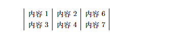

### 2、下划线

~~~
\documentclass[UTF8]{ctexart}

\begin{document}

\begin{tabular}{|c|c|c|}
\hline
内容1  & 内容2  & 内容6\\
\hline
内容3  & 内容4  & 内容7\\
\hline
\end{tabular}

\end{document}

~~~

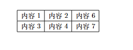

~~~
\documentclass[UTF8]{ctexart}

\begin{document}

\begin{tabular}{|c|c|c|}
\hline
内容1  & 内容2  & 内容6\\
\hline\hline
内容3  & 内容4  & 内容7\\
\hline
\end{tabular}

\end{document}
~~~

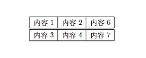

### 3、表格大小

==p设置表格大小==

~~~
\documentclass[UTF8]{ctexart}

\begin{document}

\begin{tabular}{|p{3cm}|p{2cm}|p{5cm}|}
\hline
内容1  & 内容2  & 内容6\\
\hline\hline
内容3  & 内容4  & 内容7\\
\hline
\end{tabular}

\end{document}
~~~

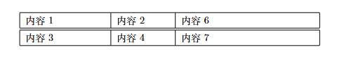

### 4、表格标题

==先放入table环境==

~~~
\documentclass[UTF8]{ctexart}

\begin{document}

\begin{table}
\centering
\begin{tabular}{|p{3cm}|p{2cm}|p{5cm}|}
\hline
内容1  & 内容2  & 内容6\\
\hline\hline
内容3  & 内容4  & 内容7\\
\hline
\end{tabular}
\caption{这是一个表格}
\end{table}

\end{document}

~~~

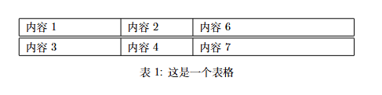
